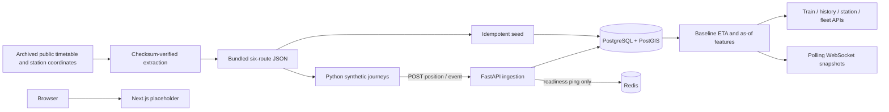

# Architecture — Phase 3

The default stack contains FastAPI, PostgreSQL 15 with PostGIS 3.3, Redis 7.4
and the static Next.js/Tailwind shell. The optional `simulation` Compose profile
runs the Python telemetry generator. The backend applies Alembic migrations
and seeds the historical network before accepting requests.

## Storage

- **stations**: unique historical code, name, zone, latitude/longitude and
  POINT geometry, SRID 4326, with a GiST index.
- **routes / route_stops**: train number/name, source distance, dataset version,
  schematic LINESTRING, ordered station foreign keys, cumulative distances and
  nullable arrival/departure offsets. Offsets span multiple IST calendar days.
- **live_positions**: UUID sample ID, journey ID, train, timezone-aware timestamp,
  POINT and coordinates, distance, delay, speed and adjacent station pair.
  Optional `journey_started_at` anchors timetable offsets; the simulator supplies
  it on every sample and ingestion enforces that it stays constant per journey.
  Train/time and journey/time indexes support time-series access. One timestamp
  per train/journey is unique.
- **events**: UUID event ID, journey, train, timestamp, type, severity 1–3,
  synthetic description and duration. Active interval is timestamp through
  timestamp + duration_seconds. Train/time is indexed.
- **historical_delays**: train/station/day-of-week/hour aggregate shape, unique per
  combination. Monday is 0 and hour is IST 0–23. Legacy daily aggregates keep
  hour -1 (unknown) and are excluded from hourly lookup. Starts empty; no invented
  observations are seeded. Downgrade protects existing hourly data from loss.

The selected PostGIS stack replaces the older plan's TimescaleDB choice.
Telemetry uses indexed PostgreSQL tables, **not a TimescaleDB hypertable**.
Partitioning/retention can be added if data volume warrants it. Dataset geometry
is schematic; see [data sources](data_sources.md) for its limits.

## Ingestion and journey lifecycle

Input validation enforces finite coordinates/speeds, aware timestamps, seeded
trains, adjacent station pairs, route distances and coordinate consistency.
Writes serialize on the route row. Samples within a journey must advance in
time without going backwards or exceeding the 200 km/h ingestion ceiling.
Identical UUID/body retries return 200 without another row; reused UUIDs with
changed content return 409. New samples return 201. Database errors produce a
sanitized 503. See [the contract](api_contract.md).

The simulator runs at real-time speed and anchors each train's origin departure
to process start, independently of the archived wall-clock departure time.
Schedule offsets still determine running time, overnight transitions and dwell.
Planned-clock slowdown accumulates delay; it never adds random coordinate jumps.
Finishing or restarting creates a new journey ID, preserving old observations.
Transport retries reuse the exact sample; exhausted retries fail visibly.

One simulator process coordinates synthetic directional occupancy blocks. Run
only one for the MVP. This does not represent actual track topology or signals.
The simulator is an optional profile so ordinary development does not accumulate
telemetry unless explicitly started. Named volumes preserve data across restarts.

## Baseline and shared features

`app.eta` calculates each upcoming arrival from the immutable journey anchor,
unwrapped timetable offsets and the current delay. Legacy journeys infer a
stable anchor from their first sample and label that approximation. The active
prediction and independent comparison baseline currently match; model version
is null. No recovery rule, model training or accuracy claim is present.

`app.features` separates database context loading from hand-tested arithmetic.
All observations/events are bounded by the target sample time. It measures
station elapsed time when observed, remaining source distance, current delay,
next-station history by IST weekday/hour, active journey event severity and
nearby train count. Unknown history/station arrival remains null with a missing
indicator. Congestion deduplicates train journeys before section/time filtering
and uses great-circle distance on the schematic coordinates. See the
[feature definitions](api_contract.md#feature-definitions) for exact boundaries.

`app.read_api` serves typed REST responses for six trains, ETA, paginated journey
positions, station arrivals and fleet summary. Unfinished trains become stale
at more than 30 seconds without an observation. Station arrivals exclude them
by default; fleet means count only active trains. Completed and no-data cases
are distinct. Future-dated observations never displace a present observation.

WebSocket connections obtain a fresh snapshot in a worker thread using a
short-lived SQLAlchemy session once per second. A changed position, feature or
status is sent; response-time changes alone are suppressed. Each connection
receives an initial snapshot and releases its receiver on disconnect. There is
no Redis pub/sub or retained event queue in Phase 3. Slow/lost connections can
reconnect to the current snapshot and use history for past positions.

## Scope boundary

Redis remains a healthy infrastructure dependency for Phase 4, which adds
publishing, shared caching, rate limiting and sub-second delivery. XGBoost/SHAP
and measured model evaluation remain Phase 5. Passenger/station/control views
remain Phase 6; the frontend is still a placeholder. Public deployment,
authentication and TLS remain outside this local synthetic demo.
