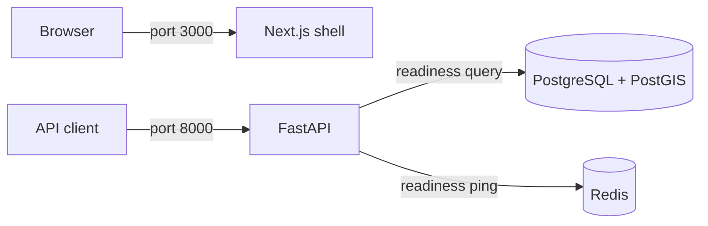

# Architecture

Phase 1 provides a FastAPI service, a static Next.js/Tailwind shell, PostgreSQL
15 with PostGIS 3.3, and Redis 7.4. The upgraded plan replaces the older plan's
TimescaleDB choice with PostGIS. The MVP targets six simulated coaching trains,
XGBoost with SHAP, and evaluation against current-delay carryover.

Only infrastructure is active. The frontend does not yet fetch train data.
Backend readiness checks PostGIS query execution and Redis connectivity.
Compose gates startup on service health, with persistent named database/cache
volumes. Database/cache ports remain private to the Compose network.
Application ports bind to the host's loopback interface for local development.

Later phases introduce sourced station/route data and synthetic telemetry,
then ingestion, REST/WebSocket contracts, shared feature engineering, ETA
inference and three frontend views. No schema, route fixtures, simulator,
train endpoints, trained model or measured prediction improvement exists yet.

This Compose stack is a development scaffold. Authentication, TLS, operational
monitoring, data retention and public deployment are outside Phase 1.

Framework setup references: [Next.js installation](https://nextjs.org/docs/app/getting-started/installation),
[Tailwind with Next.js](https://tailwindcss.com/docs/installation/framework-guides/nextjs),
and [FastAPI containers](https://fastapi.tiangolo.com/deployment/docker/).
