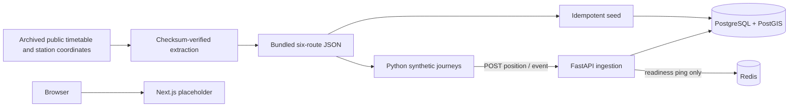

# Architecture — Phase 2

The default stack contains FastAPI, PostgreSQL 15 with PostGIS 3.3, Redis 7.4
and the static Next.js/Tailwind shell. The optional `simulation` Compose profile
runs the Python telemetry generator. The backend applies Alembic migrations
and seeds the historical network before accepting requests.

## Storage

- **stations**: unique historical code, name, zone, latitude/longitude and
  POINT geometry, SRID 4326, with a GiST index.
- **routes / route_stops**: train number/name, source distance, dataset version,
  schematic LINESTRING, ordered station foreign keys, cumulative distances and
  nullable arrival/departure offsets. Offsets span multiple IST calendar days.
- **live_positions**: UUID sample ID, journey ID, train, timezone-aware timestamp,
  POINT and coordinates, distance, delay, speed and adjacent station pair.
  Train/time and journey/time indexes support time-series access. One timestamp
  per train/journey is unique.
- **events**: UUID event ID, journey, train, timestamp, type, severity 1–3,
  synthetic description and duration. Active interval is timestamp through
  timestamp + duration_seconds. Train/time is indexed.
- **historical_delays**: train/station/day-of-week aggregate shape, unique per
  combination. Monday is 0. Starts empty; no invented observations are seeded.

The selected PostGIS stack replaces the older plan's TimescaleDB choice.
Telemetry uses indexed PostgreSQL tables, **not a TimescaleDB hypertable**.
Partitioning/retention can be added if data volume warrants it. Dataset geometry
is schematic; see [data sources](data_sources.md) for its limits.

## Ingestion and journey lifecycle

Input validation enforces finite coordinates/speeds, aware timestamps, seeded
trains, adjacent station pairs, route distances and coordinate consistency.
Writes serialize on the route row. Samples within a journey must advance in
time without going backwards or exceeding the 200 km/h ingestion ceiling.
Identical UUID/body retries return 200 without another row; reused UUIDs with
changed content return 409. New samples return 201. Database errors produce a
sanitized 503. See [the contract](api_contract.md).

The simulator runs at real-time speed and anchors each train's origin departure
to process start, independently of the archived wall-clock departure time.
Schedule offsets still determine running time, overnight transitions and dwell.
Planned-clock slowdown accumulates delay; it never adds random coordinate jumps.
Finishing or restarting creates a new journey ID, preserving old observations.
Transport retries reuse the exact sample; exhausted retries fail visibly.

One simulator process coordinates synthetic directional occupancy blocks. Run
only one for the MVP. This does not represent actual track topology or signals.
The simulator is an optional profile so ordinary development does not accumulate
telemetry unless explicitly started. Named volumes preserve data across restarts.

## Scope boundary

No train/ETA read APIs, shared feature engineering, Redis publishing, WebSocket
updates, trained model or functional passenger/station/control views exist yet.
Redis remains a healthy infrastructure dependency for Phase 4. The frontend
communicates the current phase without presenting synthetic numbers as live
railway information. Public deployment, authentication, TLS and ingestion rate
limiting remain outside this local Phase 2 demo.
