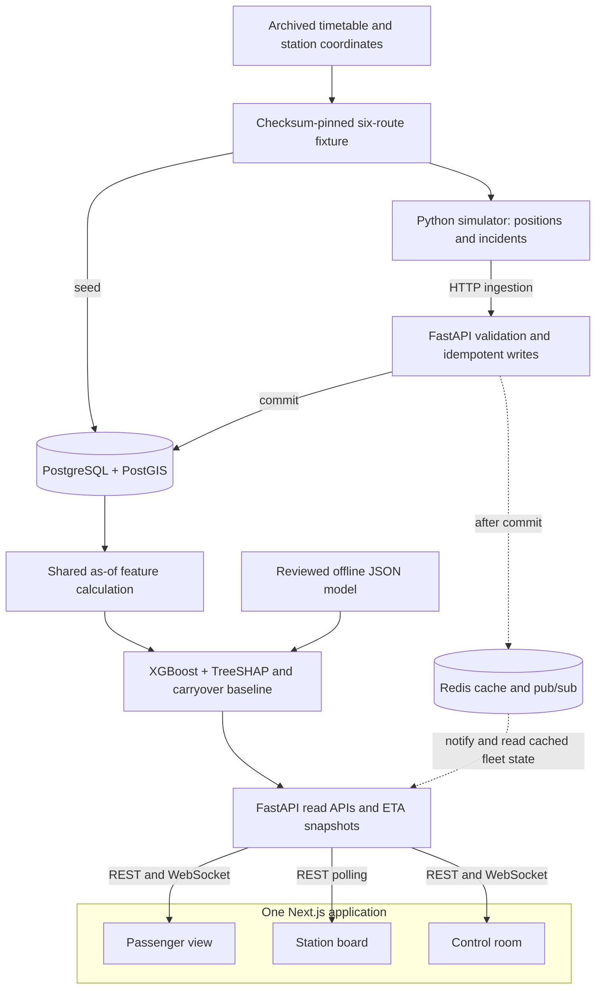

# RailScope architecture

## System overview

RailScope turns changing train observations into one explained next-station ETA
calculation shared by passenger, station and control views. Six synthetic trains
run on an attributed historical network. PostgreSQL/PostGIS preserves route and
journey evidence; shared features feed XGBoost and an independent carryover
baseline. Redis notifies connected API workers when committed observations
change, and the frontend presents both predictions and their freshness.

This is a logical data-flow diagram, not a list of separate deployed services.
Ingestion, feature calculation, prediction and read APIs are modules of one
backend. Browser HTTP reads go through the Next.js GET-only proxy; WebSockets
connect directly to the backend. Route metadata also comes through the API.
The backend and frontend run alongside PostgreSQL, Redis and **one** simulator:
five local Compose services.

| Component | Responsibility |
| --- | --- |
| Historical fixture | Supplies six routes, 63 station coordinates and 91 route stops with source timetable distances/offsets; preserved attribution and checksums make seeding repeatable. |
| Simulator and ingestion | Generate real-time synthetic movement and disruptions; validate route consistency and sample order, enforce optional ingestion credentials and rate/body limits, and deduplicate UUID retries. |
| PostgreSQL/PostGIS and features | Store observations, events and route geometry; compute features as of the selected observation, preserving unknown values. This is the prototype's feature layer, not a separately deployed feature-store product. |
| XGBoost, TreeSHAP and baseline | Load one reviewed JSON artifact, predict next-station delay relative to current delay, explain its residual and preserve a carryover comparison. Other stations and unsupported cases use the baseline. |
| Redis and API delivery | Cache observed fleet state and notify workers after SQL commit. REST and WebSocket ETA snapshots share the same calculation. Reconnection and periodic reconciliation recover current state after missed notifications. |
| Three Next.js views | Let passengers inspect a train, station boards list arrivals, and controllers inspect fleet trends/history. Each labels synthetic data, missing evidence, staleness and prediction fallbacks. |

### Offline model lifecycle

Training is separate from the running demo. The existing simulator generates
complete synthetic journeys; offline code reuses the serving feature arithmetic,
splits whole journeys chronologically, selects a model using validation data,
and evaluates later held-out journeys. A reviewed JSON artifact and metadata
are then included in the backend image. Startup loads the artifact; it does not
fit or retrain a model. See the [model card](../ml/README.md) for the measured
83.0% synthetic MAE improvement and its limits.

The remaining sections describe implementation details and failure behavior.
For startup and the demonstration sequence, see the [submission overview](README.md).

## Storage

- **stations**: unique historical code, name, zone, latitude/longitude and
  POINT geometry, SRID 4326, with a GiST index.
- **routes / route_stops**: train number/name, source distance, dataset version,
  schematic LINESTRING, ordered station foreign keys, cumulative distances and
  nullable arrival/departure offsets. Offsets span multiple IST calendar days.
- **live_positions**: UUID sample ID, journey ID, train, timezone-aware timestamp,
  POINT and coordinates, distance, delay, speed and adjacent station pair.
  Optional `journey_started_at` anchors timetable offsets; the simulator supplies
  it on every sample and ingestion enforces that it stays constant per journey.
  Train/time and journey/time indexes support time-series access. One timestamp
  per train/journey is unique.
- **events**: UUID event ID, journey, train, timestamp, type, severity 1–3,
  synthetic description and duration. Active interval is timestamp through
  timestamp + duration_seconds. Train/time is indexed.
- **historical_delays**: train/station/day-of-week/hour aggregate shape, unique per
  combination. Monday is 0 and hour is IST 0–23. Legacy daily aggregates keep
  hour -1 (unknown) and are excluded from hourly lookup. Starts empty; no invented
  observations are seeded. Downgrade protects existing hourly data from loss.

The selected PostGIS stack replaces the older plan's TimescaleDB choice.
Telemetry uses indexed PostgreSQL tables, **not a TimescaleDB hypertable**.
Partitioning/retention can be added if data volume warrants it. Dataset geometry
is schematic; see [data sources](data_sources.md) for its limits.

## Ingestion and journey lifecycle

Input validation enforces finite coordinates/speeds, aware timestamps, seeded
trains, adjacent station pairs, route distances and coordinate consistency.
Writes serialize on the route row. Samples within a journey must advance in
time without going backwards or exceeding the 200 km/h ingestion ceiling.
Identical UUID/body retries return 200 without another row; reused UUIDs with
changed content return 409. New samples return 201. Database errors produce a
sanitized 503. See [the contract](api_contract.md).

The simulator runs at real-time speed and anchors each train's origin departure
to process start, independently of the archived wall-clock departure time.
Schedule offsets still determine running time, overnight transitions and dwell.
Planned-clock slowdown accumulates delay; it never adds random coordinate jumps.
Finishing or restarting creates a new journey ID, preserving old observations.
Transport retries reuse the exact sample; exhausted retries fail visibly.

One simulator process coordinates synthetic directional occupancy blocks. Run
only one for the MVP. This does not represent actual track topology or signals.
The simulator starts by default. Stop it before running another simulator or the
bounded acceptance smoke. Named volumes preserve data across restarts.

The same backend image accepts DATABASE_URL and PORT on managed hosts. Its
startup command migrates and seeds before listening. The optional INGEST_API_KEY
guards writes before body parsing or Redis access; the cloud Blueprint generates
and shares a key with its one worker. The prepared cloud configuration places
PostGIS, Redis, the API and worker on Render and Next.js on Vercel; cloud
deployment remains manual. Public reads pass through the Next.js proxy, and
WebSockets connect directly to the public HTTPS API as WSS. See
[deployment](deployment.md) for the configuration and manual setup.

## Baseline and shared features

`app.eta` calculates each upcoming arrival from the immutable journey anchor,
unwrapped timetable offsets and the current delay. Legacy journeys infer a
stable anchor from their first sample and label that approximation. The active
prediction and independent comparison baseline matched in Phases 3–4. Phase 5
adds the next-station model described below while preserving that baseline.

`app.features` separates database context loading from hand-tested arithmetic.
All observations/events are bounded by the target sample time. It measures
station elapsed time when observed, remaining source distance, current delay,
next-station history by IST weekday/hour, active journey event severity and
nearby train count. Unknown history/station arrival remains null with a missing
indicator. Congestion deduplicates train journeys before section/time filtering
and uses great-circle distance on the schematic coordinates. See the
[feature definitions](api_contract.md#feature-definitions) for exact boundaries.

`app.read_api` serves typed REST responses for six trains, ETA, paginated journey
positions, station arrivals and fleet summary. Unfinished trains become stale
at more than 30 seconds without an observation. Station arrivals exclude them
by default; fleet means count only active trains. Completed and no-data cases
are distinct. Future-dated observations never displace a present observation.

`app.realtime` owns Redis train channels, versioned per-train caches and the
shared rate budget. Ingestion commits SQL before invalidating/publishing; UUID
retries repeat delivery without another SQL row. Fleet reads assemble six cached
states, recalculating freshness at request time. Cold entries query only their
train using train/time indexes. Entries expire within 60 seconds and before the
next future-dated sample becomes eligible. A compare-and-set revision prevents
a fill racing a commit from restoring stale state; as-of ordering prevents an
older concurrent fill within one revision from replacing a newer fill.

WebSockets acknowledge subscription before their initial SQL snapshot, then react
to Redis messages across API workers. Calculations run in worker threads with
short-lived SQLAlchemy sessions. A single-slot queue coalesces bursts; unchanged
snapshots are suppressed. Connections also reconcile every 15 seconds and wake
at the stale threshold. Redis listener failures produce a sanitized error and
close 1011; receivers/subscriptions are cleaned up on disconnect.

`app.ingest_guard` applies a Redis fixed-window budget before parsing a bounded
16 KiB JSON body. Limits are shared by both ingestion endpoints and all API
processes using the namespace. Strict parsing prevents non-finite numeric input
from leaking into validation-error serialization. The supplied server disables
proxy-header handling so spoofed forwarding headers cannot evade the peer limit.

There is no distributed SQL/Redis transaction or durable outbox. A failure after
commit can return 503 for an already-stored observation: retrying the same UUID
republishes and repairs cache state. A process crash before publication can lose
a notification; the reconciliation timer and cache expiry recover current SQL
state. Redis failure before rate checking denies new ingestion, while direct
DB read APIs remain available. Fleet/WS endpoints require Redis. This is an
explicit local-demo delivery policy, not a production availability guarantee.

## Scope boundary

The implemented scope includes the three dashboards, XGBoost/TreeSHAP, baseline
fallbacks, optional ingestion credentials, and local Compose deployment. The
historical network, synthetic telemetry and synthetic evaluation are explicitly
labeled. Read endpoints are public; there are no user accounts or role-based
access controls. The prepared Render/Vercel setup is not evidence of a deployed
cloud service, production availability or operational railway accuracy.

The simulator's blocks and geometry are approximations, and Redis notifications
have no durable replay. Real feed integration, surveyed track/signaling data,
automatic model retraining and scale/availability validation remain outside the
prototype. See [dashboard behavior](dashboards.md), [data provenance](data_sources.md)
and the [submission limitations](README.md#api-checks-and-submission-scope).

## Prediction path

The backend loads a checksum-validated CPU XGBoost JSON artifact at startup.
`app.model_features` fixes the input order; offline `ml.dataset` calls the same
pure arithmetic in `app.features` as serving. Unversioned historical averages
are excluded from the model to avoid future-data leakage. Offline labels are
observed next-station arrivals and complete journeys are split chronologically.

One shared `build_eta` path serves REST, station boards and WebSockets. The next
station receives the model residual plus observed current delay, with exact
native TreeSHAP contributions and explicit clipping adjustments. Independent
baseline timestamps remain available; later stations keep the baseline.
Missing/invalid artifacts, inferred anchors and out-of-range inputs degrade to
baseline-only predictions with an explicit status. Redis fleet caches continue
to hold observed state, not stale model predictions. No model training runs in
HTTP requests, API startup or CI. See the [model card](../ml/README.md) for the reviewed evaluation,
reproduction commands, deployment controls and production-job boundary.
