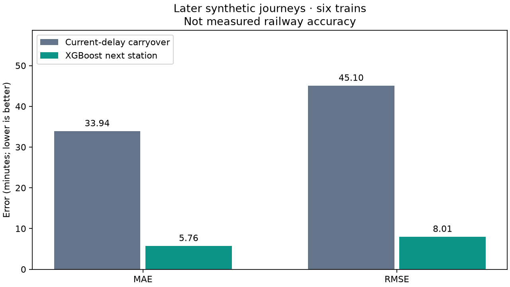

# Phase 5 model card and reproduction

The bundled **synthetic-next-station-v1** model predicts minutes of delay at the
**next station** using CPU XGBoost. It learns a residual relative to current
delay. `predict(features)` adds that residual to current delay and floors delay
at zero. The API also prevents an ML arrival preceding the observation time.
Downstream stations retain the independent carryover baseline.

## Measured result

| Held-out prediction | MAE (minutes) | RMSE (minutes) |
| --- | ---: | ---: |
| Current-delay carryover | 33.941 | 45.098 |
| XGBoost with serving fallbacks/clipping | 5.759 | 8.013 |

MAE is **83.0% lower** on 24 later synthetic journeys. All six train groups
improve; detailed metrics and chronological boundaries are in
[results/metrics.json](results/metrics.json). The predefined acceptance gate was
at least 10% lower test MAE and lower test RMSE. It passed.



**This is not evidence of real railway accuracy.** The data comes entirely from
the existing stochastic timetable simulator on the six attributed historical
routes. The large improvement reflects learnable simulator dynamics, including
its frequent random disruptions; operational delays may behave very differently.
There are no real GPS observations, passenger trips, incident feeds or fabricated
historical averages in this experiment. No LSTM stretch model is included.

## Data, targets and leakage control

`generate.py` runs 18 cohorts of six complete, independently simulated journeys,
starting 2026-01-01 and spaced four days apart. It reuses `simulator.engine.Train`,
seed 2026, a five-second integration step, 120-second sampling plus every station
crossing, and the simulator's default mean event interval of 180 seconds. This
produced 117,520 positions and 44,951 synthetic events. Train identifiers and
payload UUIDs are deterministic; generated data is ignored by Git.

These independent runs do not apply shared fleet block contention. Congestion
features still count nearby same-section observations in the combined as-of
snapshot. This is a synthetic proxy, not an operational signaling simulation.

The target is the first observed arrival timestamp minus the shifted timetable
arrival at the next station. A label must belong to the same train/journey,
follow the feature timestamp, and cross the expected next station. Skipped stops,
incomplete journeys and samples without a provided journey start are excluded.
Arrival labels from this generator have at most five seconds of sampling error.
Database exports can have up to 120 seconds of error; sparser crossings are
excluded rather than silently treated as precise arrivals.

The split uses complete journey start/end times, **not randomly shuffled rows**:

| Partition | Journeys | Feature rows | Observation/label period (UTC) |
| --- | ---: | ---: | --- |
| Train | 66 | 71,673 | Jan 1 – Feb 12 |
| Validation | 18 | 19,593 | Feb 14 – Feb 24 |
| Test | 24 | 26,146 | Feb 26 – Mar 12 |

Boundary-crossing journeys are purged. Tree depths 2, 4 and 6 are compared only
on validation MAE; depth 6 wins. The held-out period is evaluated after selection,
without retraining on validation/test. Rows within a journey are correlated;
row counts must not be interpreted as independent experimental trials.

`dataset.py` imports `app.features.feature_values` directly; `model_features.py`
defines one ordered input vector for training and serving. Tests compare offline
and database-derived features on the same observations, including future events.
Missing observed station timing remains NaN. Historical averages/counts are
excluded because `historical_delays` has no availability timestamp: using its
current values in old training rows could leak future arrivals. The table is
exported for audit and remains in the public API feature contract. It must be
versioned before adding those averages to the model.

## Artifact and serving

`models/eta_model.json` uses XGBoost's portable JSON format, not pickle.
`models/metadata.json` records feature order/version, target, data/network/model
SHA-256 hashes, provenance, library version, ranges, hyperparameters, training
time and all evaluation metrics. Runtime/dev dependencies are hash-locked in
`backend/requirements*.txt`; the backend Docker image includes the artifact and
CPU runtime. Runtime predictions do not need training data or network access.

The immutable model loads once at API startup. `ETA_MODEL_ENABLED=false` disables
it; `ETA_MODEL_DIR` overrides the model directory for host processes (a container
override also needs an explicitly mounted directory). Restart after changing an
artifact. A missing/corrupt/incompatible/unapproved model leaves baseline serving
available and returns `ml_status=unavailable`. Readiness checks storage and Redis;
model failure is a graceful fallback, not a readiness failure.

Each numeric feature must lie inside training min/max bounds; missing observed
station timing is allowed. Outside these bounds, API responses explicitly fall
back to the baseline. This guard does not detect every form of distribution
shift. Legacy inferred journey starts also retain baseline-only predictions.
Evaluation includes exactly these numerical domain fallbacks and arrival floors.
No-data and completed journeys return no invented next-station prediction.

Exact native **TreeSHAP** uses `Booster.predict(pred_contribs=True)`. Its bias plus
all feature contributions equals the predicted residual. Adding current delay
and the separately reported clipping adjustment gives the final delay. Positive
contributions increase the residual relative to the model's expected residual;
negative contributions reduce it. These are model attributions, **not causal
explanations** of railway incidents. The API returns all contributions so the UI
can choose the largest ones without losing the additive total.
See [XGBoost's prediction reference](https://xgboost.readthedocs.io/en/release_3.0.0/python/python_api.html#xgboost.Booster.predict).

## Reproduce locally (Python 3.12)

From the repository root, after installing the hashed backend development lock:

```sh
PYTHONPATH=backend backend/.venv/bin/python -m ml.generate
PYTHONPATH=backend backend/.venv/bin/python -m ml.train --output /tmp/sih-eta-retrain
PYTHONPATH=backend backend/.venv/bin/python -m ml.evaluate
```

Generation and fitting are explicit offline commands; normal API startup and CI
never train. Output includes a comparison table/plot, per-train metrics and JSON
artifact. The default generated dataset is `ml/data/synthetic.json.gz`; its
uncompressed SHA-256 must match the recorded `data_sha256`. The timestamp changes
on retraining, but the fixed-data/fixed-version model and metrics are reproducible.
Review metrics and metadata before manually promoting any new artifact. Do not
use the held-out test period for further tuning; reserve new later journeys.

To export your existing telemetry instead, configure database environment
variables as in the root README and run:

```sh
PYTHONPATH=backend backend/.venv/bin/python -m ml.export --output ml/data/export.json.gz
PYTHONPATH=backend backend/.venv/bin/python -m ml.train --input ml/data/export.json.gz --output /tmp/sih-eta-candidate
```

Exports use a repeatable-read snapshot of live_positions, events and
historical_delays. Training requires at least six distinct completed journey
start times and nonempty chronological partitions. A two-minute smoke run is
**not** enough training history. The exporter is read-only; offline generation
never modifies the running demo database.

## Historical-delay job stub

```sh
PYTHONPATH=backend backend/.venv/bin/python -m ml.refresh_history
# After reviewing the dry-run count, explicitly apply derived averages:
PYTHONPATH=backend backend/.venv/bin/python -m ml.refresh_history --apply
```

The stub groups observed station arrivals by train/station/IST weekday/hour.
It counts each journey/station once and upserts sample counts and means
idempotently. It never invents historical values or schedules itself. Existing
legacy buckets without new observations remain unchanged. The production
scheduler/retrain hook is documented in the script but not enabled; production
needs single-run locking, versioned historical snapshots, monitoring, new
held-out data and an explicit promotion step.
